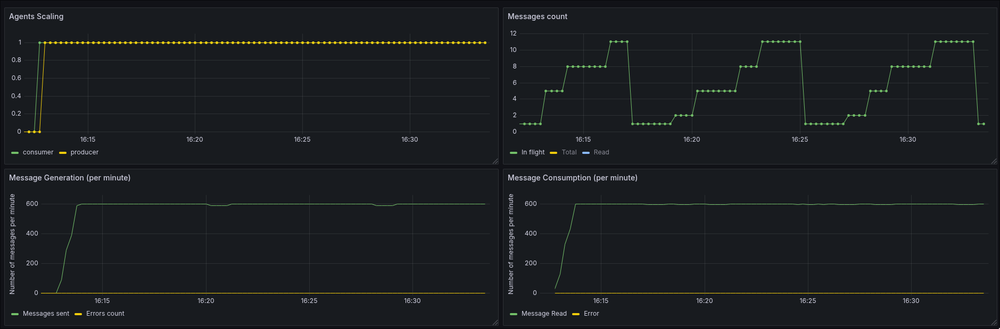
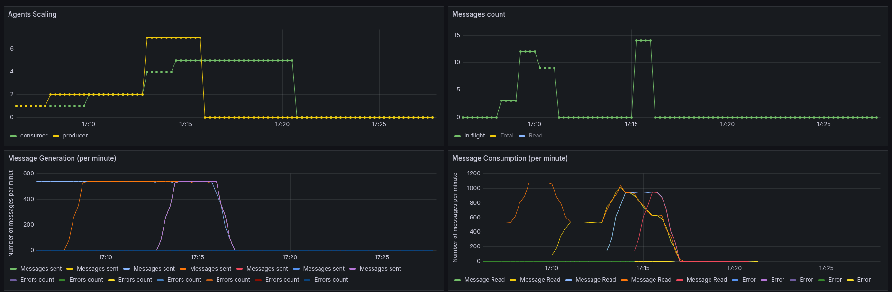
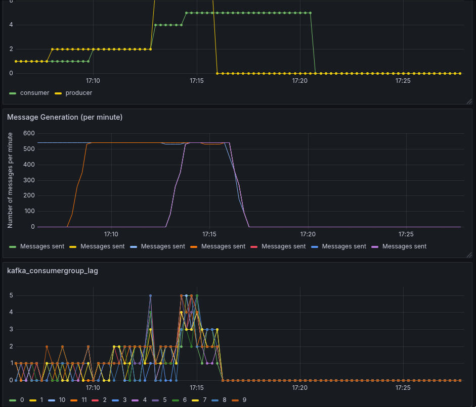
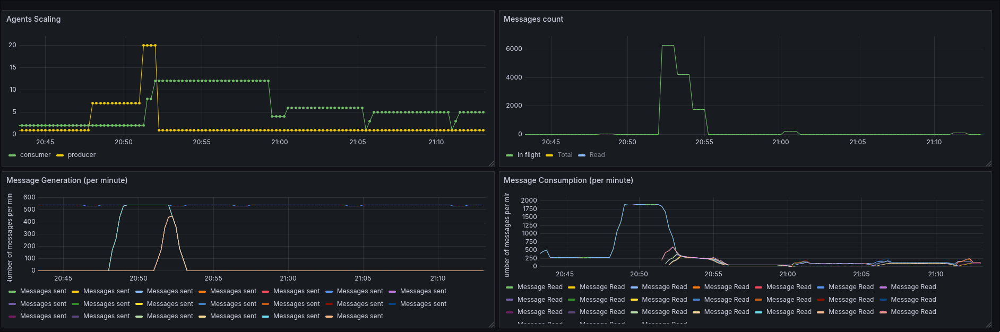
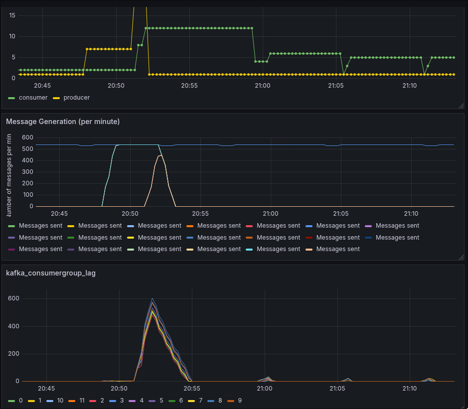
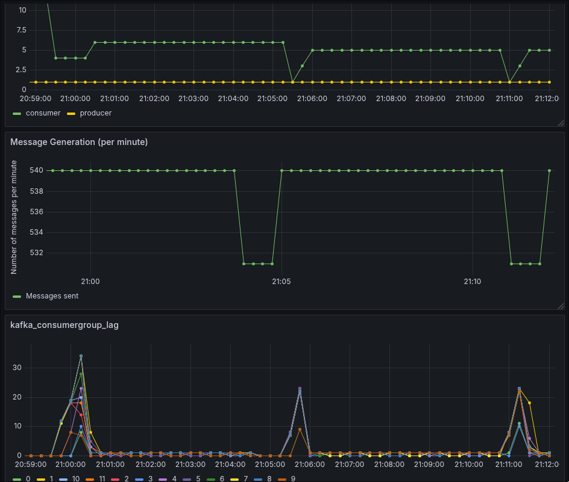
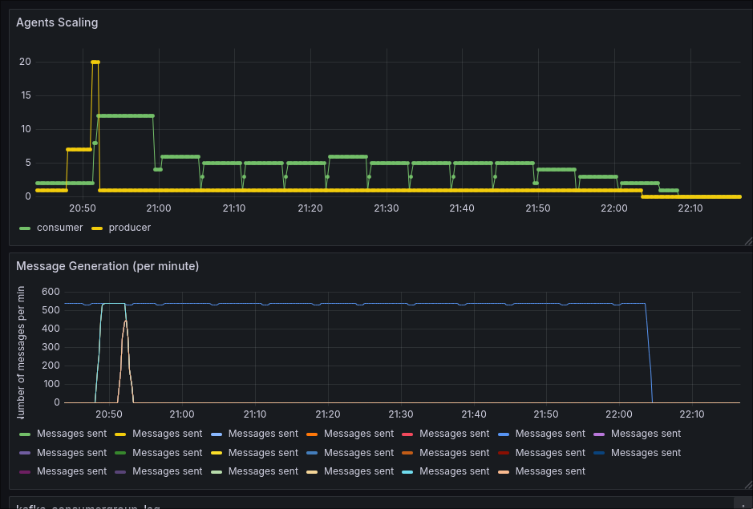

Problem → Approach → Experiment → Results → Lessons Learned. 

This article starts with conversation with my friend. He is happy owner of the kafka - based horozontally scaled processing setup. And when I asked him why doesn't he use autocaling he mentioned several concerns such as unclear how kafka behaves during downscaling. His biggest concern was that kafka downscaling can lead to unpredictable results during topics re-assignment, particularly when number of consumers don't match the number of partitions in the topic and if it can lead to the message drop.  

As naturally curious person and someone who was waiting for opportunity to start writing for a while I simple couldn't resist to put my hands to the work and do some experimentation. 

Action plan amerged by itself - install kafka, put together consumer/producer. Add parallel layer of the messages tracking and examine its work with triggering downscaling.

Before jumping into the experiment I must have done some research. What kind of beast kafka is. 
Kafka main feature is the persistence. Thus stream of messages can be replaied from the very begining. It has its benefits
as well as the price you'll need to pay to store this messages or put extra effort to wipe the data once in a while.

Secondsly kafka has quite interesting scaling strategy. Kafka arranges the message stream into topics. Every topic is split into partitions. Number of partitions are set during topic creation. The most curious is that within single consumer group there could be only one reader. 
In practice it means that maximum number of parallel processes reading messages is limited to number of topic partitions. 
Number of partitions can be changed on the flight (as later experiment shows) but it requires manual intervention and carries the risk of loss of messages order and some other nasty outcomes. [EO] - [Expansion opportunity]

Thus before using kafka as Message queue future thoutput should be carefully measured and load planned. In some cases it would mean end of the story for kafka and autoscaling but if application thoutput can be capped or measured and other kafka feature are hard requirement then planning for the future is something you need pay attention from the very beging. 
To some extend question of how far can we scale with current setup is the question that will come to the scene sooner or later and having those questions appear sooner is not that bad. 

Also maximum number of partitions per topic is capped by `200,000` so with carefull planning and ability to scale down kafka is more than just viable choice for the message based scaling. 

With all that in mind conversation about autoscaling should start when you have fully functional setup capable of handling the maximum load your application can experience. From this point the autoscaling is mostly downscaling to save some money by cutting the underutilised resources. 

There is one disclaimer I should make here - I'll be describing autoscaling in the context of kubernetes. 
Also I'll be focusing on the official KEDA autoscaling [solution for kafka](https://keda.sh/docs/2.19/scalers/apache-kafka/) comparison of scalers is the subject for completely another story. Yet worth mentioning other viable options. 
HPA - is a built in autoscaler and has its merits, yet it will require to take  about what metrics you going to use for autoscaling. CPU/Memory or 3d party metrics can be choosen  based on your workload and should be made available. To be entirely correct KEDA is just a message queue specific wrapper that feeds metrics to HPA.

Another excellent way of autoscaling on top of kafka messanging is [KNative](https://knative.dev/) stack wich I personally big fan of, yet I would reccomend it for cases when you are able to build all application around event-driven architecture. 

It is important to clarify here, that purpose of this experiment is to see how kafka downscales with KEDA in particular environment. 

Moving on with KEDA. 

KEDA allows smooth plug of the message lag as a source of autoscaling. While CPU or RAM - based metrics has their merits, message lag is a stock standard way of judging how message processing going as it effectively indicates number of messages waiting for processing.

Installation process is pretty [straight forward](https://keda.sh/docs/2.19/deploy/#installing):
```sh
helm repo add kedacore https://kedacore.github.io/charts  
helm repo update
helm install keda kedacore/keda --namespace keda --create-namespace

# and to verify installation
kubectl get pods -n keda
```

If you like me and would like to keep the copy of installation sources there would be one more step:

```sh
helm repo add kedacore https://kedacore.github.io/charts  
helm repo update

helm pull kedacore/keda --untar
helm install keda ./keda --namespace keda --create-namespace

# and verify
kubectl get pods -n keda
```

After that you need to create the autoscaler object. It looks like this:
```yaml
apiVersion: keda.sh/v1alpha1
kind: ScaledObject
metadata:
  name: <object-name>
  namespace: kafka
spec:
  scaleTargetRef: # refference to the scaled object details here: https://keda.sh/docs/2.19/reference/scaledobject-spec/
    apiVersion: apps/v1 # default
    kind: Deployment 
    name: consumer # name of scaled object shoudl exist
  maxReplicaCount:  12
  triggers:
  - type: kafka # reference to the existing kafka instance
    metadata:
      # following fields are repeating kafka connection params from your client:
      bootstrapServers: my-cluster-kafka-brokers.kafka.svc.cluster.local.:9092
      consumerGroup: consumers # consumer group name
      topic: 12-part-topic # topic from config
```
All the fields are very well documented on [official site](https://keda.sh/docs/2.19/scalers/apache-kafka/).

Be carefull creating this object. If all fields are correct autoscaler will override values configured in the scaled object immidietely. 


In very short, KEDA's Metrics Server exposes the lag value to the Kubernetes Horizontal Pod Autoscaler (HPA). The HPA then uses a target `lagThreshold` to determine the total number of replicas needed. The KEDA Operator polls the Kafka brokers at defined `pollingInterval` 
The HPA calculates the desired number of replicas using this standard formula:
`DesiredReplicas=CurrentLag/lagThreshold` as simple as it is. 

For example, if your `lagThreshold` is set to 100:

1. Lag = 50: 1 replica (since it's > 0, KEDA ensures at least 1 is running).
2. Lag = 250: 3 replicas (250/100).
3. Lag = 0: After the `cooldownPeriod` expires, KEDA scales the deployment back to 0 (if `minReplicaCount` is 0)

As we have multiple patitions Lag is a sum of all partition lags.

Few more details about experiment. Messages will be generated, saved into MongoDB, then sent thru kafka. During processing they will be marked as received in Mongo. This paralell approach will help us to have a count of the messages drop if any. 
I've vibe-coded 2 main components:
 1. Producer: to generate message IDs, insert them into Mongo and send them to Kafka.
 2. Consumer: to read messages from Kafka,  mark them as read in Mongo. 

 + one more service component that reads messages counts total/read/unread allowing us to have the source of truth on the number of messages in the flight and allows us see number of dropped messages. 

Kafka topic is created with default parameters and 12 partitions. 

Prior to introduction of autoscaling I've manage to pick the timeouts and sizes of batches so the consumer capacity matches the producer generation with small margin. 
Here is how it looks on chart:


From left to right, top to bottom:
  
  - `Agents Scaling` - number of pods running producer/consumer
  - `Messages Count`  - number of messages in the flight sourced from Mongo.
  - `Message Generation(per minute)` number of messages generated by producer per minute, reported by producer
  - `Message Consumption (per minutes)` total number of messages read by consumers per minute, reported by consumer

As you can see the number of message in the flight fluctuates around single digits number.

Now, enabling autoscaling:



I've manually added number of producers up to 7, watching how austscaling mechanics getting triggered scaling number of consumers up to 5. Then turning off all producers, that triggered downscaling to 0.

Interesting chart to add here is state of lags per partition:



Interesting thing to note, despite being using only 1 consumer - we can see that lag fluctuates 0/1 for all partitions wich makes me concude that all 12 partitions are in use for single consumer. 

Later we see jump of lag across all partitions, leading to scale up in consumers and visible jump of message in flight according to mongo counter. 

As soon as producers are removed and lag is getting back to 0, autoscaling ramp number of consumers all the way to 0. 

Another important observation is that no messages were lost so far :) 

First of all let's see how the system reacts to the scenario of sudden spike from idle processing to maximum and how it getting itself back to idle. 



As you can see with 1 producer - scaling in balancing with 2 consumers. 
When number of producers is ramped up to 7 and then to 20, number of consumers maxes out at 12 and stays this way until the lags are getting back to around 0. 



Interesting bit to notice is what is going on when lag is getting back to 0 and stays there for a while.


As total lag size is hitting 0, autoscaling is removing several consumers. From 12 to 4. That is causing kafka to rebalance the partitions amonst consumers. 
That is causing the lag to ramp up, which in term is causing scale up event, thus number of consumers is getting back to 6. 

This dance of push/pull continues for one hour.

Until system returns to original scale of 1 producer and 1 consumer. 
...tbd - continue here;
